# Recipe API Documentation

**Version:** 1.0  
**Git Project URL:** [RecipeApi](https://github.com/bernardAppah/recipeApi)

## Introduction
The Recipe API platform provides a set of endpoints for registered users to manage and explore recipes. Users can add new recipes, find recipes based on name, update existing recipes, and delete recipes.

This documentation is intended for developers who want to integrate recipe management capabilities into their applications.

---

## Endpoints
1. Register a user
   - EndPoint: /api/recipe/register-user
   - Method: POST
   - Path parameters: There are two required parameters for this endpoint: name and password.
   - Description: Creates a new user account to access the recipe API.
   - Response:
     + Scenario 1: Unique username:
       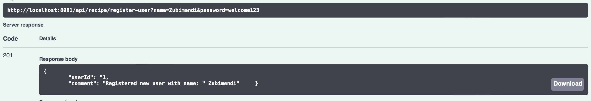

     + Scenario 2: When an existing username is provided:
       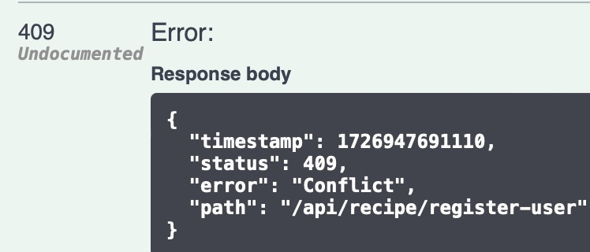

2. Add a new recipe
    - EndPoint: /api/recipe/add-recipe
    - Method: POST
    - Path parameters: Only one parameter is required and that is the userId.
    - Description: Creates a new recipe as entered by a registered user.
    - Request:
        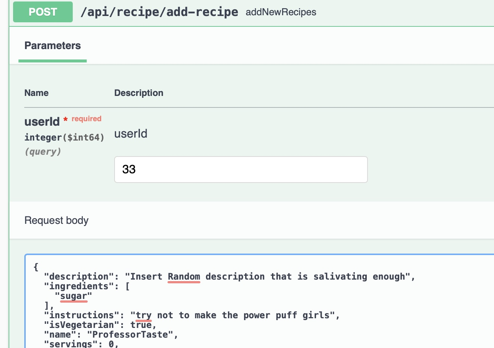
    - Response:
      + Scenario 1 : Attempt to create a recipe with a registered user
        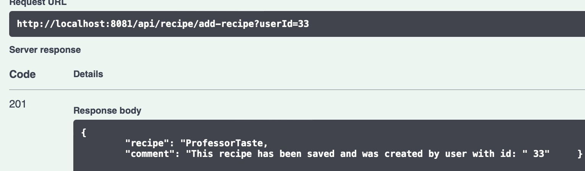
      + Scenario 2 : Attempt to create a recipe with an unregistered user
        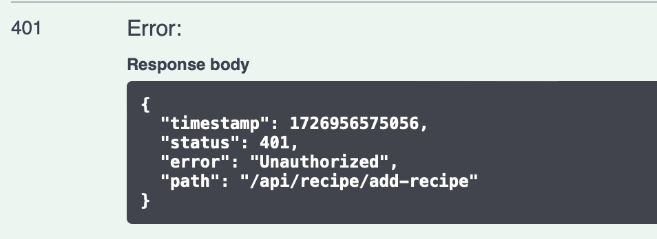

3. Update an existing recipe
    - EndPoint: /api/recipe/update-recipe-details
    - Method: PATCH
    - Path parameters: Only two parameters are required: the userId and 
      the name of recipe to be updated.
    - Description: Registered users can update recipes they have added.
    - Request:
         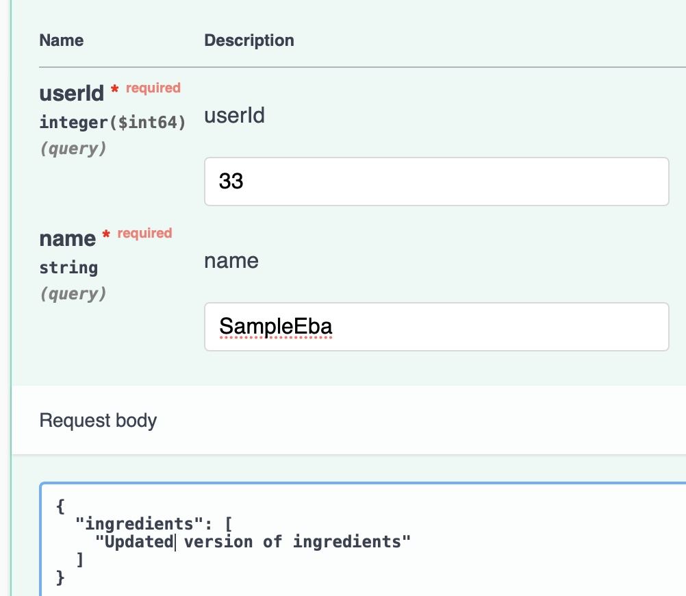
    - Response:
      + Scenario 1 : Attempt to update an existing recipe.
        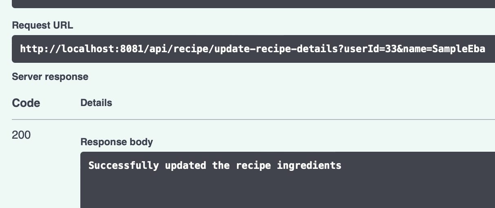
      + Scenario 2 : Attempt to update a recipe that does not exist.
        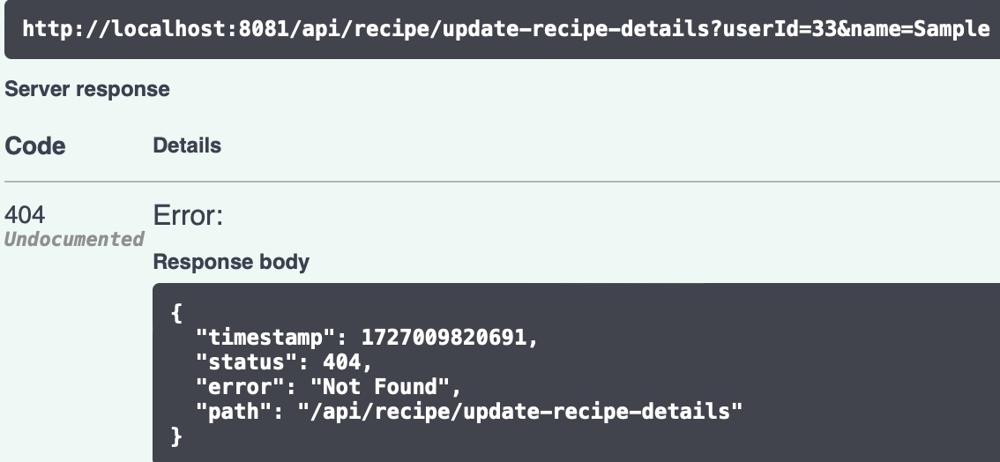

4. Find recipe based on name
    - EndPoint: /api/recipe/get-recipe
    - Method: GET
    - Path parameters: Only two parameters are required: the userId and
      the name of recipe.
    - Description: Registered users can find recipes that have been added either by them
      or other registered users.
    - Response:
        + Scenario 1 : Attempt to find an existing recipe.
          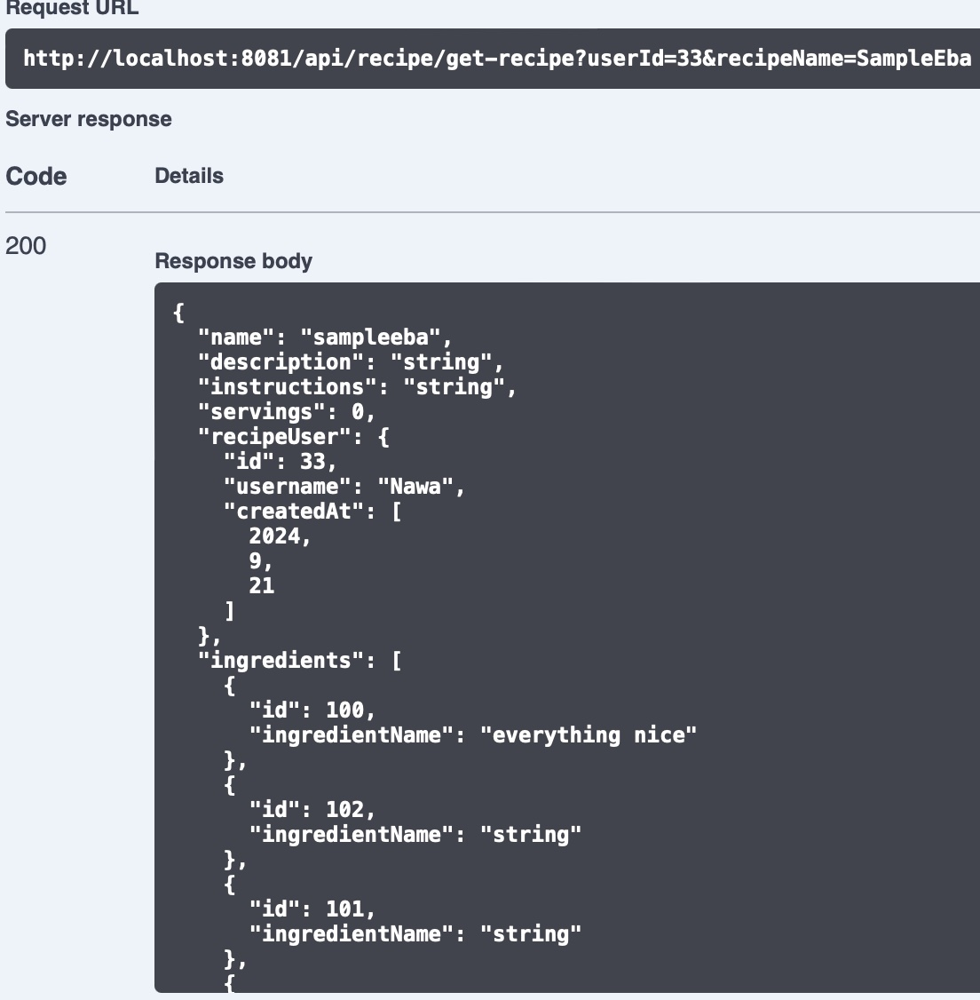
        + Scenario 2 : Attempt to find a recipe that does not exist.
          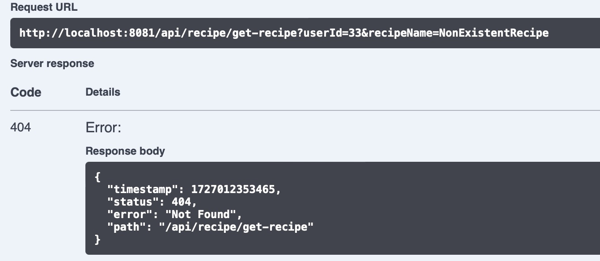

5.  Delete Recipe
    - EndPoint: /api/recipe/delete
    - Method: DELETE
    - Path parameters: Only one parameter is required and that is the userId.
    - Description: Deletes an existing recipe. A registered user can only delete recipes, 
      if it was added by them.
    - Request: As part of the request body, only the name of recipe is required.
        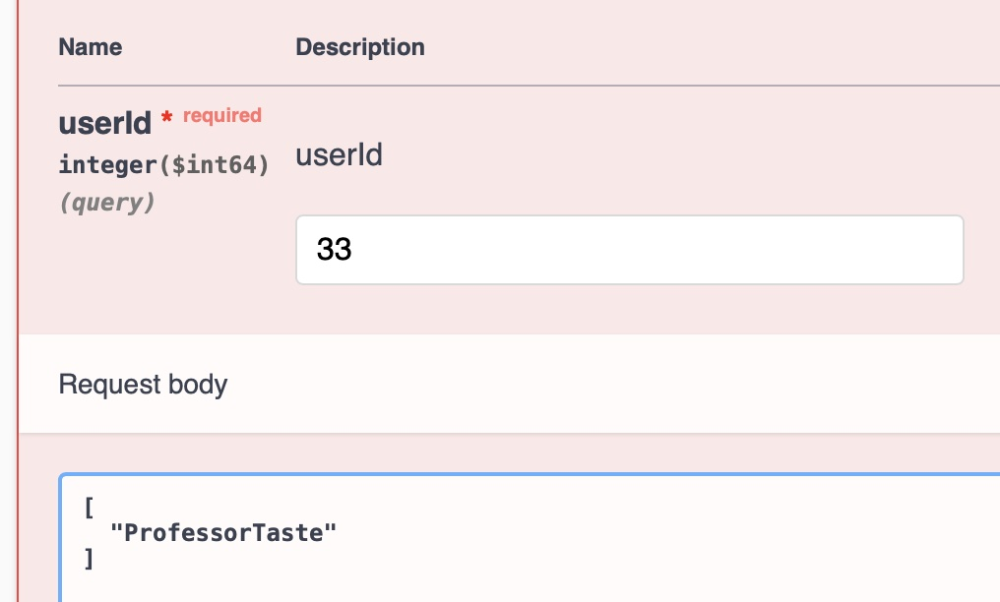
    - Response:
        + Scenario 1 : Attempt to delete a recipe as the registered user who created it
          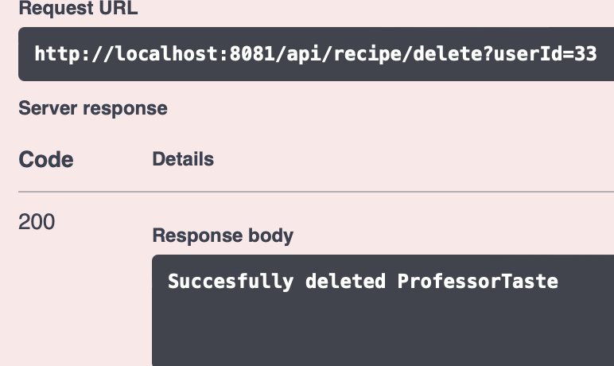
        + Scenario 2 : Attempt to delete a recipe as a registered user who did not create it.
          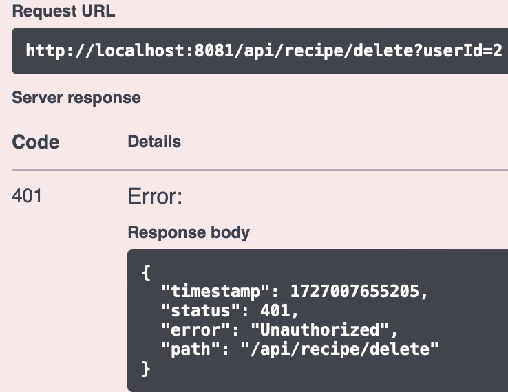

---
          
## Common Error Codes:

| Error Code       | Description                                |
|------------------|--------------------------------------------|
| 401 Unauthorized | The user is not authenticated.             |
| 404 Not Found    | The requested resource could not be found. |
| 409 Conflict     | The resource already exist.                |

---

## Further Information:
For further information about this API, After starting the application, assuming its
running on your localhost go to the url below to view the available endpoints.

```
http://localhost:8081/swagger-ui/index.html
```

