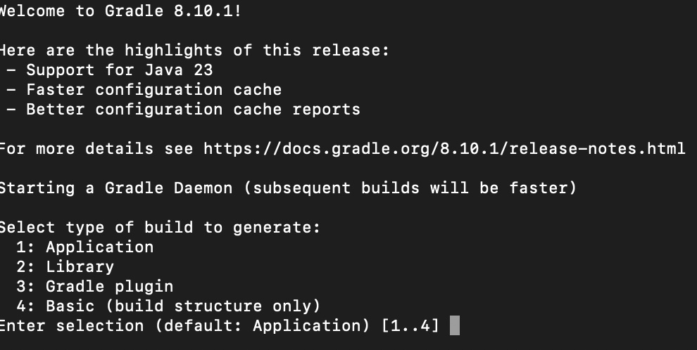
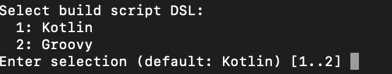
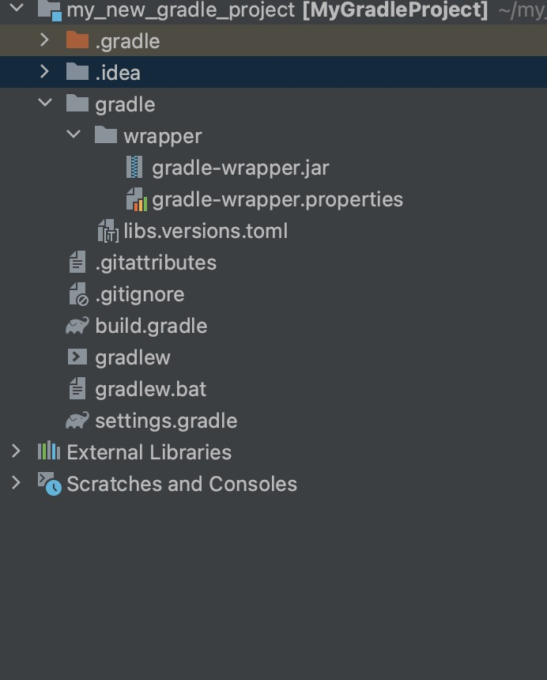

# Setting up a new Gradle Project

# Table of Contents
- [Overview](#overview)
- [Step-by-Step guide](#step-by-step-guide)
- [Common troubles](#common-troubles)
- [Further Studies](#further-studies)

## Overview
This guide would illustrate how to set up a gradle project from scratch without any
hassle.

Assuming you already know what gradle is,then you can skip the remainder of this section 
and move over to the next section.

Gradle in simple terms is a build tool that is used to automate the building, testing
and deployment of software projects. It has become popular in recent times when compared
to its counterpart in maven because of its performance advantages and the fact that is built
for modern frameworks.

---
## Step-by-Step-Guide
+ Ensure that you have gradle installed, you can easily verify this by entering the following command
  ```
  gradle v
  ```
  This should hopefully return the version of gradle you have installed. However, if you 
  get an error, you can follow instructions on how to install gradle here:
  [Installing gradle](https://docs.gradle.org/current/userguide/installation.html)

+ Create a new directory. You can either do this manually or via the command line with
    ```
    mkdir my_new_gradle_project
    ```
+ Navigate to the directory with the following command
     ```
    cd my_new_gradle_project
    ```
+ Initialise the gradle project as this would help set up the build files
  ```
  gradle init
    ```
  As part of running this command, you will have to answer a few questions. Usually pertaining
  to the type of project for you and the build script DSL
  
  **I would recommend selecting basic as build type as it forms a basis for which you can build on.**

  
  **Your choice here majorly depends on what domain specific language you are familiar with.** 

+ After that is done you should now have an initial set up that should look like this:
  
  There are a ton of gradle files generated, however the most important ones are the build.gradle.kts,
  settings.gradle.kts, the .gradle directory and the gradle wrapper. The **build.gradle** is the main build 
  file for the project and this is the place where most of the build configuration will end up. 
  The **setting.gradle** contains settings that Gradle reads before actually starting your build (for instance,
  the root project name goes here). The **Gradle wrapper** ensures everyone working with the project is using the
  same version of gradle.
  
---
## Common Challenges
In this section, we would highlight some common challenges that may be associated with setting the gradle project
as described above:
+ The gradle V command returns an error even when gradle is installed. In that case, ensure thta is has been
  added to the systems path correctly.
+ Unfamiliarity with command line. If you are not familiar with command line, please refer to 
  [Command line basics](https://developer.mozilla.org/en-US/docs/Learn/Tools_and_testing/Understanding_client-side_tools/Command_line).
+ The number of generated files may be overwhelming, especially for newcomers. Knowing which files are crucial and their purposes is essential.

---
## Further Studies
For further studies on gradle and just in general questions on how to get around with using gradle, please
refer to [Gradle docs](https://docs.gradle.org/current/userguide/gradle_basics.html)
